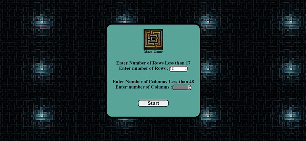

# Maze Generator & Solver

To genrate a random maze from user input and solve it using different algorithm.

There are two step of this process:
### 1.Maze Generation 

Algorithm used to Generate Maze is  **DFS**  and **Backtracking** :

The steps for generating maze are :
1. Create a grid of given number of rows,column using canvas.
2. Set the initial postion as first block of grid.
3. Input all the neighbour of current cell:
   * Randomly choose any unvisited neighbour 
   * Remove wall between current and selected neighbour's cell.
   * Send this new psoition to Stack.
   * Set next cell as current 
4. If no neighbouring cell then pop element from stack and check for its neighbour.
5. Stop when Stack is Empty.
6. Randomly select a position as goal state from Grid.

### 2.Maze Solving
To solve the maze means to reach goal state many algorithm can used here:
## 1. Depth First search (DFS)

*DFS stands for Depth First Search is an edge-based technique. It uses the Stack data structure and performs two stages, first visited vertices are pushed into the stack, and second if there are no vertices then visited vertices are popped*

The steps are :
1. Input all the neighbour of starting element in a stack.
2. Pop an element from stack and set it as our current element.
3. Enter all unvisited neighbour of current to stack.
4. Repeat step 2 & 3 until goal cell found.

## 2. Breadth First search (BFS)

*BFS stands for Breadth-First Search is a vertex-based technique for finding the shortest path in the graph. It uses a Queue data structure that follows first in first out. In BFS, one vertex is selected at a time when it is visited and marked then its adjacent are visited and stored in the queue*

The steps are :
1. Input all the neighbour of starting element in a queue.
2. Make the first element of stack as current element and shift queue forward.
3. Enter all unvisited neighbour of current to queue.
4. Repeat step 2 & 3 until goal cell found.

# Credits
- Gifs: https://ezgif.com/video-to-gif
- Definitions: https://www.geeksforgeeks.org/

# Project Info
- Project: Maze Generator & Solver
- Author: Gaurav Kedia
- Site Link: https://gauravmkedia.github.io/Maze_Game/
